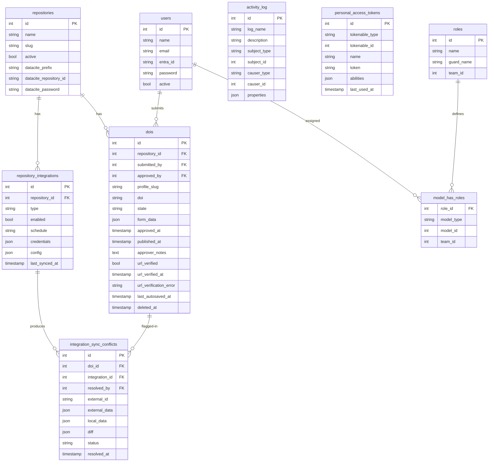

# DOI Forge — System Design Document

**Version:** 1.5 (Draft)
**Status:** In Progress
**Language:** Bilingual (EN/FR)

---

## 1. Overview

DOI Forge is an open source DOI orchestration and governance layer for institutions that need multi-user control over their DataCite repositories. It sits between users and the DataCite API, adding role-based access control, metadata profiles, an approval workflow, and a full audit trail — capabilities that DataCite Fabrica does not provide natively.

It is designed for institutions that publish across multiple resource types or workflows but cannot adopt — or choose not to adopt — a dedicated data repository platform. Research institutes, libraries, government agencies, and universities with heterogeneous publishing processes are the target audience.

DOI Forge is not a DOI registry. DataCite remains the system of record for all DOIs. DOI Forge owns the actions taken against DataCite: who requested them, who approved them, and when.

By linking datasets, publications, and other research objects through well-maintained identifiers, DOI Forge supports FAIR principles — making research outputs Findable, Accessible, Interoperable, and Reusable — and advances institutional commitments to open science, transparency, and collaboration.

### 1.1 Problem Statement

DataCite Fabrica provides one account per repository with no user-level access control and no audit logging. Institutions with multiple staff, multiple workflows, or multiple resource types have no way to enforce governance over who can mint or publish DOIs, or to demonstrate compliance with access control requirements.

Dedicated repository platforms (Dataverse, DSpace, Zenodo etc.) solve this problem well — but only for institutions that can standardise on a single platform. Institutions with five or six heterogeneous publishing processes, or those constrained by infrastructure policy, need a lighter governance layer that works with their existing workflows rather than replacing them.

### 1.2 Goals

- Provide multi-user, role-based access control scoped to DataCite repositories
- Enforce a human approval step before a DOI transitions from draft to findable
- Provide metadata profiles that simplify and standardise DOI creation across different resource types
- Log all actions with attribution for audit purposes
- Expose a simple API for automated draft DOI creation from existing publishing systems
- Monitor published DOI landing pages continuously for availability
- Support rich metadata relationships between datasets, publications, and other research objects
- Be designed with security audit and Authority to Operate (ATO) requirements in mind
- Be easily deployable as a self-hosted open source application
- Support fully bilingual interfaces (English and French built-in, extensible to other languages)

### 1.3 Non-Goals

- DOI Forge is not a full DataCite API proxy
- DOI Forge does not store or sync DOI records locally — DataCite is queried directly for DOI browsing
- DOI Forge does not replace repository platforms for institutions that already have one
- DOI Forge does not host landing pages — it monitors them

---

## 2. Name

**DOI Forge** — works identically in English and French ("une forge"). Conveys the idea of crafting and minting something deliberate and durable. The name requires no translation and carries the same meaning in both languages.

---

## 3. Architecture

### 3.1 Stack

| Component                   | Technology                                                    |
| --------------------------- | ------------------------------------------------------------- |
| Backend framework           | Laravel 13                                                    |
| Frontend framework          | Vue 3 + Inertia.js                                            |
| Frontend language           | TypeScript (strict mode)                                      |
| UI components               | shadcn-vue                                                    |
| Route/action bindings       | Laravel Wayfinder (auto-generated TypeScript route functions) |
| Data objects / TypeScript   | Spatie Laravel Data + TypeScript Transformer                  |
| Database                    | PostgreSQL 18                                                 |
| Authentication (production) | Microsoft Entra ID via Socialite (Azure provider)             |
| Authentication (local/dev)  | Laravel Breeze (session-based)                                |
| API authentication          | Laravel Sanctum (token-based)                                 |
| Permissions                 | Spatie Laravel Permission with Teams                          |
| Audit logging               | Spatie Laravel Activity Log                                   |
| Job queues                  | Laravel Horizon + Redis                                       |
| DataCite SDK                | `vincentauger/datacite-php-sdk` (built on Saloon)             |
| Sierra SDK                  | `vincentauger/sierra-php-sdk` (built on Saloon, optional)     |
| Frontend code quality       | @antfu/eslint-config (linting + formatting)                   |
| Backend code quality        | Larastan (PHPStan level 8), Rector, Laravel Pint              |
| Testing                     | Pest PHP                                                      |
| CI/CD                       | GitHub Actions with self-hosted runner                        |
| Deployment                  | Docker Compose (self-hosted, on-prem VM)                      |

### 3.2 High-Level Design

```
User (Browser)
      |
      v
Vue 3 + Inertia (TypeScript / shadcn-vue)
      |
      v
DOI Forge (Laravel 13)
  ├── Auth layer (Entra ID / Sanctum)
  ├── Permission layer (Spatie + Teams)
  ├── Approval workflow
  ├── Metadata profiles
  ├── Audit log (Spatie Activity Log)
      |
      v
DataCite API (via datacite-php-sdk)
```

External publishing systems connect via the DOI Forge API using Sanctum tokens scoped to a repository.

### 3.3 Frontend Architecture

The frontend is Vue 3 with TypeScript, rendered server-side via Inertia.js. shadcn-vue provides the base component library. There is no separate API between the frontend and backend — Inertia carries typed page props directly.

**Type safety across the stack:**

Type safety is achieved through two auto-generation layers — no manually maintained TypeScript:

```
Wayfinder (stable)        → typed route/action functions (auto-generated)
Spatie Laravel Data       → typed Data objects with colocated validation (PHP)
TypeScript Transformer    → auto-generated TypeScript from Data classes, enums, page props
```

```
PHP Data classes (form payloads, page props, API responses, enums)
    → php artisan typescript:transform
    → resources/ts/types/ (auto-generated)
    → Vue components consume fully typed shapes

PHP controllers & routes
    → wayfinder:generate
    → resources/ts/wayfinder/ (auto-generated, never manually edited)
    → Vue components call typed actions
```

**Why Spatie Laravel Data?** The DataCite metadata shape is deeply nested — `creators[].nameIdentifiers[]`, `relatedItems[].contributors[]`, `titles[]` with lang attributes. Data classes provide colocated validation on each nested structure, clean controller type-hints, and auto-generated TypeScript for all page props, form payloads, and API responses — not just the DataCite shape. The SDK (`datacite-php-sdk`) remains framework-agnostic; Data classes live in DOI Forge and mirror the SDK's DTO shapes.

**Why not Wayfinder `next`?** The `next` branch promises the same TypeScript generation for models, enums, form requests, and Inertia props — but as of March 2026 it remains in beta with known performance issues and an unstable API. This can be revisited when it reaches a stable release.

The SDK enums (`DoiState`, `RelationType`, `ResourceTypeGeneral` etc.) are PHP enums — TypeScript Transformer generates their TypeScript counterparts automatically.

**Form state mirrors DataCite schema:**

The Vue form holds DataCite-shaped data natively — `titles`, `creators`, `descriptions`, `relatedItems` etc. match the SDK structure exactly. The `relatedItems` field captures rich relationships between research objects — a publication linked to its underlying dataset, a report that supersedes a previous one, a translation of an existing work. These relationships are first-class metadata in DataCite and surfaced prominently in the DOI Forge form. There is no translation layer between what the component holds, what gets posted, and what the SDK receives.

`form_data` in the database is this same JSON. Loading a draft back into the form is `DoiData::from($doi->form_data)` on the backend and typed props on the frontend — no dehydration needed.

**Profile initialises, Vue owns:**

When a user starts a new DOI, the profile's `defaults()` pre-fill the form. From that point the user owns the data entirely. Vue components handle their own DataCite structure (`CreatorFieldGroup.vue`, `TitleField.vue`, `RelatedItemsSection.vue` etc.). The profile's `hidden()` array shows or hides sections. No dynamic renderer, no field definition system.

### 3.4 What DOI Forge Persists

DOI Forge deliberately stores only what is needed for governance. It does not mirror DOI records.

| Table                                   | Purpose                                                                                                     |
| --------------------------------------- | ----------------------------------------------------------------------------------------------------------- |
| `repositories`                          | DataCite repository config, encrypted credentials                                                           |
| `dois`                                  | Full DOI lifecycle from composing through publication — DataCite-shaped `form_data` autosaved incrementally |
| `users`                                 | Local user records, created on first Entra login                                                            |
| `personal_access_tokens`                | Sanctum API tokens (Spatie managed)                                                                         |
| `repository_integrations`               | Optional external metadata source configs per repository                                                    |
| `integration_sync_conflicts`            | Pending conflicts awaiting human resolution                                                                 |
| `activity_log`                          | Full audit trail (Spatie)                                                                                   |
| `roles / permissions / model_has_roles` | Spatie permission tables                                                                                    |

Profiles are PHP classes in `app/Profiles/` — not stored in the database. The `profile_slug` on a `dois` record is an audit reference only.

All tables use integer primary keys. Enumeration is not a concern — authentication and authorization prevent unauthorized access regardless of ID guessability. The DOI string itself (`10.1234/abc-xyz`) is the meaningful external identifier and is always returned in API responses.

DOI browsing and detail views query the DataCite API directly via the SDK.

---

## 4. Domain Model

### 4.1 Repository

A DataCite repository (one-to-one with a DataCite prefix). Holds encrypted credentials and is the top-level scope for all permissions and profiles.

**Key fields:**

- `name` — human-readable name (bilingual)
- `datacite_prefix` — e.g. `10.1234`
- `datacite_repository_id` — encrypted
- `datacite_password` — encrypted
- `active` — boolean

Credentials are stored using Laravel's built-in `encrypted` cast. They are never included in audit log payloads. Credential updates are logged as a named action (who rotated credentials, when) without recording the values themselves.

Each department deployment will start with one repository and can add more as DataCite provisioning allows (e.g. separate prefixes for publications, data, maps).

### 4.2 Profile

A profile is a PHP class in `app/Profiles/`. Its sole job is to initialise the form when a user starts a new DOI and inform validation. Once the form is open, the user owns the data entirely and can change anything — the profile does not restrict or enforce anything at runtime.

Profiles are not stored in the database. They live in the codebase, reviewed via PR, fully type-checked by Larastan.

**A profile does four things only:**

- `defaults()` — pre-fills `form_data` with DataCite-shaped JSON when a new DOI is started
- `required()` — which fields must be present for form validation
- `hidden()` — which DataCite fields to hide from the form entirely
- `validators()` — which validators must pass before the DOI can be published (see §4.3)

```php
final class CanadianTechReportProfile extends BaseProfile
{
    public function slug(): string
    {
        return 'can-tech-rep-hydrogr-ocean-sci';
    }

    public function defaults(): array
    {
        return [
            'language' => 'en',
            'types' => ['resourceTypeGeneral' => 'Report'],
            'publisher' => [
                'name' => 'Fisheries and Oceans Canada',
                'publisherIdentifier' => 'https://ror.org/02qa1x782',
                'publisherIdentifierScheme' => 'ROR',
            ],
            'titles' => [
                ['title' => '', 'lang' => 'en'],
                ['title' => '', 'lang' => 'fr'],
            ],
            'descriptions' => [
                ['description' => '', 'descriptionType' => 'Abstract', 'lang' => 'en'],
                ['description' => '', 'descriptionType' => 'Abstract', 'lang' => 'fr'],
                ['description' => '', 'descriptionType' => 'SeriesInformation'],
            ],
            'relatedItems' => [
                [
                    'title' => 'Canadian Technical Report of Hydrography and Ocean Sciences',
                    'relatedItemType' => 'Other',
                    'relationType' => 'IsPublishedIn',
                    'relatedItemIdentifier' => '1488-5417',
                    'relatedItemIdentifierType' => 'ISSN',
                ],
            ],
            'alternateIdentifiers' => [
                ['alternateIdentifier' => '1488-5417', 'alternateIdentifierType' => 'ISSN'],
            ],
        ];
    }

    public function required(): array
    {
        return ['titles', 'creators', 'descriptions', 'url', 'publicationYear'];
    }

    public function hidden(): array
    {
        return ['geoLocations', 'fundingReferences'];
    }

    public function validators(): array
    {
        return [DataCiteRecommendedFieldsValidator::class];
    }
}
```

The profile participates at three moments: when a new DOI is created (`defaults()` pre-fills the form), when the form is submitted (`required()` informs validation), and when an approver attempts to publish (`validators()` are evaluated as a publication gate). After the first moment it is otherwise irrelevant — the user's `form_data` is the truth.

### 4.3 Validators

Validators express metadata quality rules that must pass before a DOI can be published. They are distinct from `required()` — required fields are a submission gate enforced by the editor, validators are a publication gate enforced at approval time.

Validators are PHP classes in `app/Validators/`. Like profiles, they live in code: reviewed via PR, fully type-checked by Larastan, version-controlled.

**Two attachment points:**

- **Profile-level** — a profile declares its own validators via `validators()`. Applies to DOIs started with that profile.
- **Repository-level** — an admin can configure validators that apply to all DOIs on a repository regardless of profile, covering institutional compliance floors (e.g. a GC Open Government minimum that every repository must meet).

Both sets are evaluated together at approval time.

**Two severity levels:**

- `error` — hard block. The approver cannot publish until the condition is resolved. The DOI must be rejected back to the editor.
- `warning` — advisory. The approver sees the issue and must explicitly acknowledge it before approving. Does not block publication on its own.

**Interface:**

Validators receive a `DoiData` DTO — the same Spatie Data object constructed via `DoiData::from($doi->form_data)` that is passed to the DataCite SDK. This gives validators fully typed, IDE-navigable access to the nested DataCite shape rather than raw array access.

```php
interface ValidatorInterface
{
    /** Human-readable name shown in the approver UI. */
    public function name(): string;

    /** @return ValidationResult[] */
    public function validate(DoiData $data): array;
}
```

```php
final class ValidationResult
{
    public function __construct(
        public readonly ValidationSeverity $severity, // Error | Warning
        public readonly string $field,
        public readonly string $message,
    ) {}

    public static function error(string $field, string $message): self { ... }
    public static function warning(string $field, string $message): self { ... }
}
```

**Example:**

```php
final class DataCiteRecommendedFieldsValidator implements ValidatorInterface
{
    public function name(): string
    {
        return 'DataCite Recommended Fields';
    }

    public function validate(DoiData $data): array
    {
        $results = [];

        if ($data->descriptions->isEmpty()) {
            $results[] = ValidationResult::warning('descriptions', 'At least one description is strongly recommended by DataCite.');
        }

        $hasNameIdentifier = $data->creators
            ->some(fn (CreatorData $creator) => $creator->nameIdentifiers->isNotEmpty());

        if (!$hasNameIdentifier) {
            $results[] = ValidationResult::warning('creators', 'At least one creator should have a name identifier (e.g. ORCID).');
        }

        return $results;
    }
}
```

The DTO has already been constructed and validated by the time validators run — there is no redundant `DoiData::from()` call. The same instance used for the DataCite SDK call is passed to each validator.

**Where validators run:**

1. **At submission (advisory)** — validator results are computed and surfaced to the editor so they can address issues before the DOI reaches the approver's inbox. Does not block submission.
2. **At approval (gate)** — validators run again before the approval is processed. Any `error`-level result blocks approval. `warning`-level results are shown to the approver, who must acknowledge each one before the approval proceeds.

Running validators at submission gives editors early feedback. Running them again at approval ensures the gate is enforced on the final `form_data` state, not whatever the editor saw when they originally submitted.

**Approver UI:**

The approval view shows a validator results panel. Errors are listed with a clear block indicator. Warnings have an acknowledgement checkbox per item. The Approve button is disabled until all errors are resolved and all warnings acknowledged.

**Activity log:**

Acknowledged warnings are recorded in the activity log at approval time — which warnings were present, and that the approver acknowledged them. This provides an audit trail for deliberate decisions to publish with known metadata gaps.

### 4.4 User

Created automatically on first Entra ID login. No roles are assigned on creation — an admin must explicitly grant repository access and assign a role (observer by default). In local/dev mode, Breeze-style authentication is used with the same user model.

### 4.5 DOI Record

A DOI record tracks the full lifecycle from initial form composition through publication. The `form_data` column holds DataCite-shaped JSON and is the single source of truth for the metadata — it is autosaved incrementally and passed directly to the SDK on submission.

**Key fields:**

- `repository_id`
- `profile_slug` — which profile initialised this form (audit reference only, plain string)
- `form_data` — JSON, full DataCite-shaped metadata, autosaved incrementally
- `doi` — null until DataCite confirms draft creation
- `state` — `DoiState` enum cast: `composing | draft | pending_approval | published | rejected | withdrawn`
- `submitted_by` — FK to users (resolved from email for API submissions)
- `approved_by` — FK to users, nullable, shown in UI
- `approved_at` — timestamp, nullable, shown in UI
- `published_at` — timestamp, nullable, set on first publication (used to detect re-approval vs first approval)
- `approver_notes` — text, nullable, shown in UI for both approval comments and rejection reasons
- `url_verified` — boolean, set by background URL verification job
- `url_verified_at` — timestamp, nullable
- `url_verification_error` — nullable, populated if verification fails
- `last_autosaved_at` — timestamp, shown in form UI ("Last saved X ago")

### 4.6 DOI State Machine & Autosave

DOI Forge maintains its own application state machine that maps onto — but is distinct from — DataCite's state model.

**State mapping:**

| DOI Forge state    | DataCite state      | Notes                                                           |
| ------------------ | ------------------- | --------------------------------------------------------------- |
| `composing`        | none                | Local only, nothing in DataCite                                 |
| `draft`            | `draft`             | DOI exists, deletable, not indexed                              |
| `pending_approval` | `draft` or `findable` | Internal governance state — DataCite state unchanged while awaiting approval |
| `published`        | `findable`          | We triggered the transition                                     |
| `rejected`         | `draft` or `findable` | Returned to editor for corrections, resubmittable — DataCite state unchanged |
| `withdrawn`        | none                | Cancelled — DataCite draft deleted, record soft-deleted locally |

`pending_approval` is purely internal. When a new DOI is submitted for first publication, DataCite remains `draft`. When a published DOI is edited and resubmitted, DataCite remains `findable` with the previous metadata — DOI Forge holds the pending changes in `form_data` and only pushes to DataCite on approval. The approval handler always issues a metadata update; for first publication this includes the `event: "publish"` flag to transition DataCite from `draft` to `findable`.

The `DoiState` PHP enum makes this explicit:

```php
enum DoiState: string
{
    case Composing       = 'composing';
    case Draft           = 'draft';
    case PendingApproval = 'pending_approval';
    case Published       = 'published';
    case Rejected        = 'rejected';
    case Withdrawn       = 'withdrawn';

    public function existsInDatacite(): bool
    {
        return match($this) {
            self::Composing, self::Withdrawn => false,
            default                          => true,
        };
    }

    /** Whether the DOI has ever been published (findable) in DataCite. */
    public function isReapproval(Doi $doi): bool
    {
        return $doi->published_at !== null;
    }

    public function isEditable(): bool
    {
        return in_array($this, [self::Composing, self::Draft, self::Rejected]);
    }
}
```

**State machine:**

```
[New DOI started — profile defaults pre-fill form]
        |
        v
    composing  ←──────────────────────── [Rejected: back with notes]
    (autosaved)                                        ↑
        |                                              |
 [Create Draft]                                        |
        |                                              |
        v                                              |
 (DataCite API: create draft)                          |
        |                                              |
        v                                              |
      draft ──── [Submit for approval]                 |
      (editable,        |                              |
       autosaved)       v                              |
               VerifyUrlJob (queued)                   |
               /              \                        |
         [URL ok]         [URL fails]                  |
              |                |                       |
              v                v                       |
      pending_approval    url_invalid                  |
      (form locked,      (notifies editor              |
       approver inbox)    to fix URL)                  |
           |    \                                      |
     [Approve]  [Reject] ─────────────────────────────┘
           |
    validators run
    (errors block,
     warnings require
     acknowledgement)
           |
           v
         |
         v
     published  ──── [Edit published DOI] ───┐
  (DataCite: findable)                       |
       ↑                                     v
       |                              pending_approval
       |                              (DataCite stays findable,
       |                               form_data holds changes)
       |                                   /    \
       |                            [Approve]  [Reject] → editor fixes
       |                                 |            and resubmits
       |                          validators run
       └──────────── (pass) ──────(update metadata
                                   in DataCite)
```

**States:**

- `composing` — local only, nothing in DataCite, autosaved via debounced PATCH
- `draft` — DOI exists in DataCite (deletable, not indexed), form still editable and autosaved
- `pending_approval` — awaiting human review, form locked. DataCite state is unchanged (remains `draft` for new DOIs, `findable` for published DOIs being edited)
- `published` — DOI is findable in DataCite, permanent, cannot be deleted. Can be edited, which triggers re-approval
- `rejected` — returned to editor with notes, expected to be corrected and resubmitted. DataCite state unchanged
- `withdrawn` — deliberately cancelled by editor or admin. DataCite draft deleted if it existed. Record soft-deleted locally but retained for audit. Distinct from `rejected` — a withdrawn DOI is not expected to be resubmitted

**URL verification** runs as a queued job when a DOI is submitted for approval. If the target URL returns a non-2xx response the state transitions to `url_invalid` and the editor is notified. Because some institutional URLs sit behind auth or VPN, an approver can override the URL check and approve regardless — the verification result is advisory, not a hard block.

**Autosave:** The Vue form debounces a PATCH to `dois/{id}/autosave` two seconds after the last change. No validation runs on autosave — only on explicit "Create Draft" or "Submit for Approval" actions. The form can be closed and resumed at any point.

**Data flow to DataCite:**

```
Vue form_data (DataCite-shaped JSON)
    ↓ POST
DoiData (Spatie Data — validates + hydrates)
    ↓
$data->toArray() → CreateDOIInput::fromArray(...)
    ↓
DataCite SDK → DataCite API
```

No translation layer — the Data classes mirror the DataCite shape exactly, so `->toArray()` produces the same JSON the SDK expects. The `existsInDatacite()` check on `DoiState` guards every DataCite API call.

---

## 5. Permissions

Built on Spatie Laravel Permission with the Teams feature enabled. Teams map directly to repositories — a user's roles are always scoped to a specific repository.

### 5.1 Roles

| Role       | Scope          | Capabilities                                                                   |
| ---------- | -------------- | ------------------------------------------------------------------------------ |
| `admin`    | Global         | Manage repositories, assign roles, issue API tokens, full backend access       |
| `approver` | Per repository | Review and approve/reject DOIs, plus all editor capabilities                   |
| `editor`   | Per repository | Create, edit, and submit DOIs for approval                                     |
| `observer` | Per repository | View DOIs and activity on the repository (default role on assignment)          |

A user can hold different roles on different repositories (e.g. approver on publications, editor on data). Roles are cumulative — an approver inherits all editor capabilities. Observers are the starting point when a user is granted access to a repository; an admin upgrades them to editor or approver as needed.

### 5.2 Permission Events (Activity Log)

All permission changes are recorded in the Spatie activity log with attribution:

- User granted role on repository (by whom)
- User role revoked (by whom)
- API token issued (by whom, for which repository, with which abilities)
- API token revoked

This provides a complete access audit trail answering "who had what access, and when" — a common GC compliance requirement.

---

## 6. API

A focused REST API for specific integration scenarios. Not a full DataCite proxy.

### 6.1 Authentication

Sanctum personal access tokens, issued by a global admin and scoped to a repository and ability set.

```
POST /api/v1/repositories/{repository}/dois/draft
Authorization: Bearer {token}
```

Tokens are scoped with abilities, limiting blast radius if credentials are compromised:

```php
$token = $user->createToken(
    name: 'Publication System Integration',
    abilities: ['dois:draft'],
);
```

### 6.2 Endpoints (v1)

#### Create Draft DOI

```
POST /api/v1/repositories/{repository}/dois/draft
```

**Request:**

```json
{
  "profile": "journal-article",
  "submitted_by": "john.doe@dfo-mpo.gc.ca",
  "metadata": {
    "titles": [
      { "title": "My Report Title", "lang": "en" },
      { "title": "Titre de mon rapport", "lang": "fr" }
    ],
    "creators": [{ "name": "Smith, John" }],
    "publicationYear": 2026
  }
}
```

**Response (201):**

```json
{
  "doi": "10.1234/abc-xyz",
  "state": "draft",
  "id": 42
}
```

The response includes the DOI Forge record `id` so the calling system can reference it if needed. Publication in DataCite (draft → findable) always requires a human approval step in the DOI Forge web UI.

---

## 7. Audit Trail

All significant actions are recorded via Spatie Activity Log with full attribution.

### 7.1 DTO-Based Payload Logging

Because `form_data` is DataCite-shaped JSON and the SDK's `CreateDOIInput` deserializes directly from it, every API call logs the exact payload sent to DataCite — not an approximation. This is a natural consequence of the architecture rather than extra instrumentation:

```php
$input = CreateDOIInput::fromArray($doi->form_data);

// Exact payload logged before sending
activity()
    ->on($doi)
    ->withProperties(['payload' => $input->toArray()])
    ->log('doi.draft_requested');

$response = $this->datacite->createDOI($input);
```

On metadata updates, a before/after diff is logged alongside the payload:

```php
activity()
    ->on($doi)
    ->withProperties([
        'before'  => $doi->getOriginal('form_data'),
        'after'   => $doi->form_data,
        'payload' => $input->toArray(),
    ])
    ->log('doi.metadata_updated');
```

This means the audit log answers "what exactly did we send to DataCite, and what changed from the previous version" with no additional effort.

The same DTO path also enables reconciliation — a DOI created outside DOI Forge can be fetched from DataCite via the SDK, its attributes written to `form_data`, and it becomes a first-class DOI Forge record.

### 7.2 Actions Logged

- Repository created / credentials rotated
- User granted / revoked access on a repository
- API token issued / revoked
- DOI record created (`composing`)
- Draft DOI requested — with full `CreateDOIInput` payload
- Draft DOI confirmed — with DataCite response (DOI assigned)
- DOI metadata updated — with before/after diff and payload
- DOI submitted for approval
- DOI approved / rejected (with notes)
- DOI published — with DataCite response
- Draft DOI deleted
- DataCite API failure — action attempted, error and payload recorded

### 7.3 DataCite Activity Log

DataCite maintains its own activity log (`GET /dois/{id}/activities`) via the SDK. This complements the DOI Forge audit trail — between the two, departments have comprehensive coverage of both internal governance actions and confirmed DataCite state changes.

---

## 8. Notifications

Email notifications via Laravel Mail / queued jobs:

| Trigger                                        | Recipients                      |
| ---------------------------------------------- | ------------------------------- |
| Submission sent for approval                   | All approvers on the repository |
| Submission approved                            | Editor who submitted            |
| Submission rejected (with notes)               | Editor who submitted            |
| DataCite API failure (after retries exhausted) | Admin                           |

---

## 9. Queue & Error Handling

Laravel Horizon with Redis manages all background jobs.

DataCite API calls are dispatched as queued jobs with retries. If DataCite is temporarily unavailable:

- The job retries with exponential backoff
- No state is recorded until the API call succeeds
- After retries are exhausted, a failure is logged and the repository admin is notified

The Horizon dashboard is available to global admins only, behind a Gate check.

---

## 10. Landing Page Monitoring

DOI Forge continuously monitors the landing page URLs of all published DOIs. A broken landing page undermines the core promise of a persistent identifier — a DOI that resolves to a 404 is no longer FAIR-compliant.

### 10.1 Scheduled Checks

A scheduled job runs daily against all published DOIs, checking that the target URL returns a 2xx response:

```php
// routes/console.php
Schedule::command('dois:monitor-urls')->daily()->at('04:00');
```

The job updates `url_verified`, `url_verified_at`, and `url_verification_error` on each record. If a URL fails the check a notification is sent to the repository admin.

### 10.2 Failure Escalation

A single failure is treated as transient — network blips happen. The job tracks consecutive failures:

```
1 failure  → log only
2 failures → notify repository admin
3+ failures → notify global admin, flag DOI in UI as requiring attention
```

The DOI remains `published` — its DataCite state is not changed — but it is flagged in the UI so the responsible team can investigate and update the URL if needed.

### 10.3 Manual Trigger

A repository admin can trigger a URL check on demand from the DOI detail view, useful after a server migration or URL update.

---

## 11. Authentication

### 11.1 Production — Microsoft Entra ID

Laravel Socialite with the Azure provider handles Entra ID authentication. On first login, a local user record is created with no roles. An admin must grant repository access explicitly.

### 11.2 Local / Development — Laravel Breeze

A config flag switches between auth providers:

```env
AUTH_PROVIDER=entra   # production
AUTH_PROVIDER=local   # development / testing
```

Breeze tables remain in the schema to support local development and testing. The user model is shared between both providers.

---

## 12. Internationalisation

The application is fully bilingual (English and French) using Laravel's built-in localisation. All user-facing strings are in language files. Language toggle is available in the UI.

Certain metadata fields (titles, descriptions) require bilingual input when the profile specifies `"bilingual": true`. Profile validation enforces this before DTO construction.

---

## 13. Code Quality

| Tool                             | Purpose                                                                   |
| -------------------------------- | ------------------------------------------------------------------------- |
| Larastan (PHPStan level 5)       | Static analysis, PHP type safety                                          |
| Rector                           | Automated refactoring, PHP version upgrades                               |
| Laravel Pint                     | PHP code style (PSR-12)                                                   |
| @antfu/eslint-config             | Frontend linting, formatting, and code style (replaces Prettier + ESLint) |
| TypeScript strict mode + vue-tsc | Frontend type safety                                                      |
| Wayfinder                        | Auto-generated TypeScript route/action functions                          |
| Spatie Laravel Data              | Typed Data objects, colocated validation, auto-generated TypeScript       |
| Pest PHP                         | Testing — unit, feature, integration                                      |

All pull requests must pass static analysis and the full test suite via GitHub Actions before merge.

---

## 14. Testing Strategy

### 14.1 Philosophy

The SDK packages (`datacite-php-sdk`, `sierra-php-sdk`) own their own test suites — DOI Forge does not retest SDK behaviour. DOI Forge tests focus on:

- Does the right SDK call get made with the right payload?
- Does DOI Forge handle success and failure responses correctly?
- Do state machine transitions happen correctly after API calls?
- Do policies and permissions enforce correctly?

### 14.2 Test Layers

**Unit tests** — domain logic in isolation. Profile defaults, state machine transitions, `DoiState` enum behaviour, `CreateDOIInput` construction from `form_data`. No database, no HTTP, very fast.

**Feature tests** — full HTTP tests through Laravel's test client. Session auth for web routes, Sanctum token auth for API endpoints. DataCite and Sierra API calls are intercepted via mocked service interfaces. These form the bulk of the test suite.

**Integration tests** — a small suite tagged `integration` that runs against the real DataCite test account. Used for recording fixtures and for periodic smoke testing. Never run in standard CI.

### 14.3 DataCite API Testing with Saloon Fixtures

Saloon is a dependency of the SDKs. DOI Forge adds it as a dev dependency to access `MockClient` and fixture recording directly:

```bash
composer require saloonphp/saloon --dev
```

The `DataCiteService` wrapper (see section 21.5) is the boundary between DOI Forge and the SDK. Tests mock at this boundary for most cases:

```php
// Fast — no Saloon, no fixtures needed
$this->mock(DataCiteServiceInterface::class, function ($mock) {
    $mock->shouldReceive('createDraft')
         ->once()
         ->with(Mockery::type(CreateDOIInput::class))
         ->andReturn(DataCiteFixtures::createdDoi());
});
```

For tests that need to verify the full request/response cycle through the SDK, Saloon's `MockClient` is used with recorded fixtures:

```php
it('creates a draft doi via the sdk', function () {
    $mock = new MockClient([
        CreateDOI::class => MockResponse::fixture('datacite/dois/draft-created'),
    ]);

    app(DataCite::class)->withMockClient($mock);

    $result = app(DataCiteService::class)->createDraft(
        CreateDOIInput::fromArray($this->validFormData())
    );

    expect($result->doi)->not->toBeNull();
    expect($result->attributes->state)->toBe('draft');
});
```

### 14.4 Fixture Recording

Fixtures are recorded once against the DataCite test account and committed to the repository. Subsequent runs replay from files — no network required.

```
tests/
  Fixtures/
    datacite/
      dois/
        draft-created.json     ← recorded from test account
        published.json
        metadata-updated.json
        draft-deleted.json
      GetDOI/
        existing-doi.json
    sierra/
      bibs/
        search-by-doi.json
        not-found.json
```

Fixtures are recorded by running the integration test group against the test account:

```bash
# Requires DATACITE_TEST_* credentials in .env.testing
php artisan test --group=record-fixtures
```

Re-recording is intentional — deleting a fixture and re-running against the test account updates it. If DataCite changes their response format the fixture goes stale and tests fail, which is the correct behaviour.

Test account credentials live in `.env.testing` only and are never committed or used in standard CI.

### 14.5 Test Helpers

`tests/Support/` provides shared helpers:

```
tests/
  Support/
    DataCiteFixtures.php     ← typed fixture accessors (DOIData instances)
    SierraFixtures.php       ← typed fixture accessors (BibObject instances)
    RepositoryFactory.php    ← creates repository + credentials in one call
    DoiFactory.php           ← creates dois in specific states
    ProfileHelpers.php       ← returns profile instances for test scenarios
  Fixtures/
    datacite/
    sierra/
```

`DataCiteFixtures` returns typed DTO instances, not raw arrays — so tests get IDE autocomplete and type safety:

```php
final class DataCiteFixtures
{
    public static function createdDoi(): DOIData
    {
        return (new GetDOI('10.1234/test'))
            ->createDtoFromResponse(
                MockResponse::fixture('datacite/dois/draft-created')
                    ->toResponse()
            );
    }
}
```

### 14.6 What We Do Not Test

- SDK serialization and HTTP behaviour — covered by SDK test suites
- DataCite API contract — covered by fixture recording against test account
- Saloon internals — not our responsibility

### 14.7 CI Pipeline

Standard CI (on every PR):

1. Larastan static analysis
2. Rector dry-run
3. `eslint .` (antfu config — linting + formatting)
4. `vue-tsc --noEmit`
5. Pest unit + feature tests (fixtures only, no network)

Integration CI (nightly, separate workflow):

1. Pest integration tests against DataCite test account
2. Alerts on failure — indicates API contract drift

---

## 15. Deployment

### 15.1 Server Requirements

DOI Forge deploys to a standard Linux VM — no containers required. A sysadmin familiar with any PHP application will be comfortable with this stack.

The system is designed with Authority to Operate (ATO) and security audit requirements in mind: all credentials are encrypted at rest, authentication is delegated to an enterprise identity provider (Entra ID), all actions are logged with attribution, and no sensitive values are ever stored in the event log or transmitted to the frontend.

```
VM (Ubuntu 24.04 LTS)
  ├── Nginx
  ├── PHP 8.4-FPM
  ├── PostgreSQL 18
  ├── Redis (Horizon + cache)
  └── Supervisor (manages Horizon worker)
```

A provisioning shell script and example Nginx/Supervisor configs are provided in `deployment/`. An Ansible playbook is provided for departments that prefer infrastructure-as-code.

### 15.2 Configuration

All department-specific configuration via `.env`:

```env
APP_NAME="DOI Forge"  # customise per institution
APP_LOCALE=en
AUTH_PROVIDER=entra
AZURE_CLIENT_ID=
AZURE_CLIENT_SECRET=
AZURE_TENANT_ID=
DB_CONNECTION=pgsql
DB_HOST=127.0.0.1
DB_PORT=5432
DB_DATABASE=doi_forge
DB_USERNAME=doi_forge
DB_PASSWORD=
REDIS_HOST=127.0.0.1
BACKUP_PASSWORD=
BACKUP_NOTIFICATION_EMAIL=
```

### 15.3 Backups

Backups are handled by Spatie Laravel Backup. The database and application storage are backed up daily, encrypted with AES-256, and shipped to a configured destination disk — S3-compatible object storage, SFTP, or local disk depending on what the department has available.

```php
// Scheduled in routes/console.php
Schedule::command('backup:run')->daily()->at('02:00');
Schedule::command('backup:clean')->daily()->at('01:00');
Schedule::command('backup:monitor')->daily()->at('03:00');
```

Notifications on backup success or failure are sent via email. Backup health is monitored and alerts if a backup has not run within the expected window.

### 15.4 CI/CD

GitHub Actions with a self-hosted runner on the same on-prem VM. Pipeline:

1. Larastan static analysis
2. Rector dry-run (no unreviewed changes)
3. Wayfinder generation (`wayfinder:generate`) + TypeScript type check (`vue-tsc --noEmit`)
4. Pest test suite
5. Deploy:

   ```bash
   composer install --no-dev --optimize-autoloader
   pnpm ci && pnpm run build
   php artisan wayfinder:generate
   php artisan migrate --force
   php artisan config:cache
   php artisan route:cache
   php artisan view:cache
   sudo supervisorctl restart horizon
   sudo service php8.4-fpm reload
   ```

---

---

## 16. Repository Integrations

DOI Forge supports optional metadata integrations per repository. An integration connects a repository to an external metadata source for validation, enrichment, or conflict detection. Sierra is the first implementation — the pattern is designed to accommodate others (ORCID, CrossRef, federal publications databases, etc.) without schema changes.

### 16.1 Design

Integration types are PHP handler classes. Integration instances are database records. The handler knows how to connect, sync, and compare — the record holds the credentials and config.

```
app/
  Integrations/
    IntegrationInterface.php
    BaseIntegration.php
    Sierra/
      SierraIntegration.php
    Orcid/
      OrcidIntegration.php   ← future
```

```php
interface IntegrationInterface
{
    public function type(): string;
    public function sync(RepositoryIntegration $integration): void;
    public function compare(Doi $doi, mixed $externalRecord): array;
}
```

### 16.2 Schema

**`repository_integrations`** — one record per integration instance:

```php
$table->id();
$table->foreignId('repository_id')->constrained()->cascadeOnDelete();
$table->string('type');               // 'sierra' | 'orcid' | 'crossref' | ...
$table->boolean('enabled')->default(false);
$table->string('schedule')->nullable(); // cron expression, null = manual only
$table->json('credentials');          // encrypted, shape varies by type
$table->json('config')->nullable();   // type-specific settings
$table->timestamp('last_synced_at')->nullable();
$table->timestamps();
```

**`integration_sync_conflicts`** — pending conflicts awaiting human resolution:

```php
$table->id();
$table->foreignId('doi_id')->constrained('dois');
$table->foreignId('integration_id')
      ->constrained('repository_integrations')
      ->cascadeOnDelete();
$table->string('external_id');        // Sierra bib ID, ORCID ID, etc.
$table->json('external_data');        // what the external source has
$table->json('local_data');           // what DOI Forge / DataCite has
$table->json('diff');                 // computed field-level diff
$table->string('status')->default('pending');
// pending | accepted_external | accepted_local | ignored
$table->foreignId('resolved_by')
      ->nullable()
      ->constrained('users')
      ->nullOnDelete();
$table->timestamp('resolved_at')->nullable();
$table->timestamps();
```

### 16.3 Sierra Integration

The Sierra integration uses `vincentauger/sierra-php-sdk` to search the library catalogue by DOI URL. It runs only on repositories where it is enabled and only against `published` DOIs — drafts are never synced.

```php
final class SierraIntegration extends BaseIntegration
{
    public function type(): string { return 'sierra'; }

    public function sync(RepositoryIntegration $integration): void
    {
        $sierra = new Sierra(
            baseUrl: $integration->credentials['base_url'],
            clientKey: $integration->credentials['client_key'],
            clientSecret: $integration->credentials['client_secret'],
        );

        Doi::where('repository_id', $integration->repository_id)
            ->where('state', DoiState::Published)
            ->each(function (Doi $doi) use ($sierra, $integration) {
                $results = $sierra->send(
                    new GetSearchBib('https://doi.org/' . $doi->doi)
                );

                if ($results->count === 0) {
                    // Not catalogued in Sierra yet — skip
                    return;
                }

                $diff = $this->compare($doi, $results->entries[0]);

                if (!empty($diff)) {
                    IntegrationSyncConflict::create([
                        'doi_id'         => $doi->id,
                        'integration_id' => $integration->id,
                        'external_id'    => $results->entries[0]->id,
                        'external_data'  => $results->entries[0]->toArray(),
                        'local_data'     => $doi->form_data,
                        'diff'           => $diff,
                    ]);
                }
            });

        $integration->update(['last_synced_at' => now()]);
    }
}
```

### 16.4 Conflict Resolution

Conflicts are surfaced in the DOI Forge UI as a per-repository inbox. A user with appropriate permissions reviews each conflict and chooses:

- **Accept external** — update `form_data` with the external source's values, queue a DataCite metadata update
- **Accept local** — keep current values, mark conflict ignored
- **Ignore** — dismiss without resolution

All resolutions are recorded in the activity log with full attribution. Automated conflict resolution is intentionally not supported — published DOIs should not be silently overwritten.

### 16.5 Scheduling

The sync dispatcher runs hourly and checks each enabled integration against its cron schedule:

```php
// routes/console.php
Schedule::call(function () {
    RepositoryIntegration::where('enabled', true)
        ->whereNotNull('schedule')
        ->each(function ($integration) {
            if (CronExpression::isDue($integration->schedule)) {
                IntegrationSyncJob::dispatch($integration);
            }
        });
})->hourly();
```

Integrations without a schedule can be triggered manually from the repository admin UI.

## 17. Open Source Considerations

DOI Forge is designed to be adopted by any institution with minimal effort. Principles:

- **Opinionated but configurable** — sensible defaults, institution-specific values in config
- **No plugin system** — institutions fork, adapt, or contribute PRs
- **Profiles as code** — departments add profile classes to the `app/Profiles/` directory, reviewed via PR, fully typed and validated by Larastan
- **Standard PHP deployment** — deploys to any Ubuntu VM with Nginx + PHP 8.4-FPM + Redis. Provisioning script included. No containers required
- **English and French** — fully bilingual out of the box, no rework needed

A `CONTRIBUTING.md` and a seed command for example profiles will be provided. A `docs/` folder ships with the repository containing the system design document, user onboarding guide, and API reference.

---

## 18. Out of Scope (v1)

- Full DataCite API pass-through proxy
- DOI local sync / mirror
- Profile builder UI (profiles are PHP classes in v1 — adding a profile requires a code contribution)
- Multi-factor approval (single approver per submission in v1)
- DOI versioning / tombstoning workflows
- ORCID integration for creator identity
- OSP (Open Science Portal) integration handler — architecture supports it via `repository_integrations` but not built in v1
- CSAS publication profiles — will be added as additional profile classes post-MVP

---

## 19. Open Questions

- Which GC subject vocabulary should be the default for `gccore` — the Government of Canada Core Subject Thesaurus?
- Should the Horizon dashboard be exposed publicly (admin-gated) or only on an internal network interface?

---

_Document maintained in the DOI Forge repository under `/docs/design.md`_

---

## 20. Database Schema



---

## 21. Design Decisions & Rationale

This section records key decisions made during design, and why, to prevent future contributors from relitigating settled questions.

### 21.1 No Retroactive Author Sync

**Decision:** DOI Forge does not attempt to retroactively sync author metadata (including ORCID) from the OSP or any other external system after a DOI is published.

**Rationale:** A DOI record is a metadata snapshot at publication time. Without a reliable shared unique identifier between systems, author matching relies on name comparison — which fails on common names (two John Does), name changes, transliterations, and hyphenation differences. Unreliable sync is worse than no sync because it introduces silent errors into published metadata.

The correct approach is to capture the best available metadata at submission time. If an author has an ORCID, it should be provided then. The OSP integration supports this by pushing author data at DOI creation time and by offering a typeahead lookup in the submission form. Nothing more.

**If this is revisited:** A reliable implementation requires a stable shared author identifier (e.g. a ULID on OSP author records) established at submission time and stored in an `integration_author_links` table owned by the OSP integration handler. This is a non-trivial feature that should be driven by demonstrated post-launch user need, not speculative design.

### 21.2 Validators as a Publication Gate, Not a Submission Gate

**Decision:** Validators block publication at approval time, not submission. They also run at submission to give editors early feedback, but do not prevent a DOI from entering `pending_approval`.

**Rationale:** `required()` already guards submission — the editor cannot submit without mandatory fields. Validators express a higher standard: quality rules, recommended metadata, institutional compliance minimums. Blocking submission on validators would punish editors for partially complete drafts and create friction in legitimate workflows (e.g. an editor submitting for review knowing a colleague will look up the ORCID before approval). Placing the hard gate at approval keeps editorial flow unimpeded while ensuring nothing reaches DataCite without meeting the quality bar. The approver — not the editor — is the last line of defence before a DOI becomes findable, which is the appropriate place for a publication standard to be enforced.

### 21.3 PostgreSQL over SQLite

**Decision:** PostgreSQL 18 is the database engine.

**Rationale:** DOI Forge runs queue workers (Horizon) alongside web request handlers concurrently. SQLite's file-level write lock creates contention under that pattern — a background URL verification job and an autosave request will collide. PostgreSQL handles concurrent writers cleanly. It also provides proper JSON operators for querying `form_data`, full-text search if needed later, and production parity that prevents the class of bugs where SQLite's more permissive type coercion and case-insensitive `LIKE` mask issues that surface in production. Spatie Laravel Backup handles PostgreSQL dumps natively, so operational complexity is equivalent.

### 21.4 No Event Sourcing

**Decision:** Standard Eloquent models with Spatie Activity Log, not event sourcing.

**Rationale:** The audit requirements are real but well served by Spatie Activity Log combined with DataCite's own activity log. Event sourcing was considered (Laravel Verbs) but rejected because: the domain is simple, replay is never needed independently of DataCite, externally minted DOIs have no event history creating an impedance mismatch, and the operational and contribution overhead is not justified by the benefits.

### 21.5 Profiles as Code, Not Data

**Decision:** Metadata profiles are PHP classes, not database records.

**Rationale:** Profiles change infrequently and for deliberate reasons. Keeping them in code means changes are reviewed via PR, typed and validated by Larastan, and version-controlled alongside the application. A profile builder UI is out of scope for v1 — when it is built, the storage question reopens.

### 21.6 Spatie Laravel Data + Wayfinder Stable for Type Safety

**Decision:** Use Spatie Laravel Data for typed Data objects with colocated validation and auto-generated TypeScript (via TypeScript Transformer). Use Wayfinder stable for typed route/action functions. The SDK (`datacite-php-sdk`) remains framework-agnostic — Data classes live in DOI Forge only.

**Rationale:** The DataCite metadata shape is deeply nested. Writing validation as flat FormRequest rule arrays is verbose and error-prone for structures like `creators[].nameIdentifiers[]` and `relatedItems[].contributors[]`. Data classes provide colocated validation on each nested structure, clean controller type-hints, and auto-generated TypeScript for all page props, form payloads, and API responses — not just the DataCite shape. This eliminates manually maintained TypeScript files entirely. Wayfinder `next` was considered but rejected because as of March 2026 it remains in beta with an unstable API and known performance issues. This can be revisited when it reaches a stable release.

### 21.7 form_data as Pure DataCite JSON

**Decision:** The `form_data` column on the `dois` table contains DataCite-shaped JSON only. No internal identifiers (OSP author IDs etc.) are stored there.

**Rationale:** `form_data` is passed directly to `CreateDOIInput::fromArray()` with no translation layer. Mixing internal identifiers into the DataCite shape would require stripping logic before every API call and would couple the DataCite schema to DOI Forge internals. Integration-specific data (OSP author links etc.) belongs in tables owned by the relevant integration handler.
